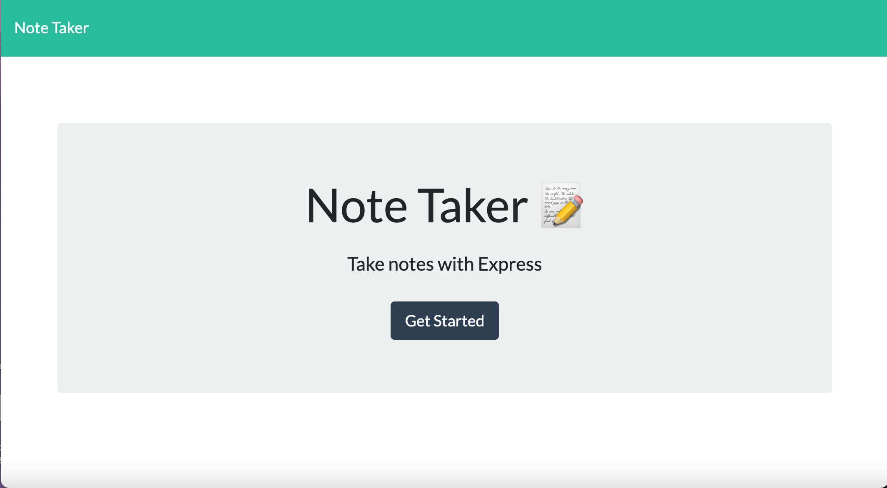
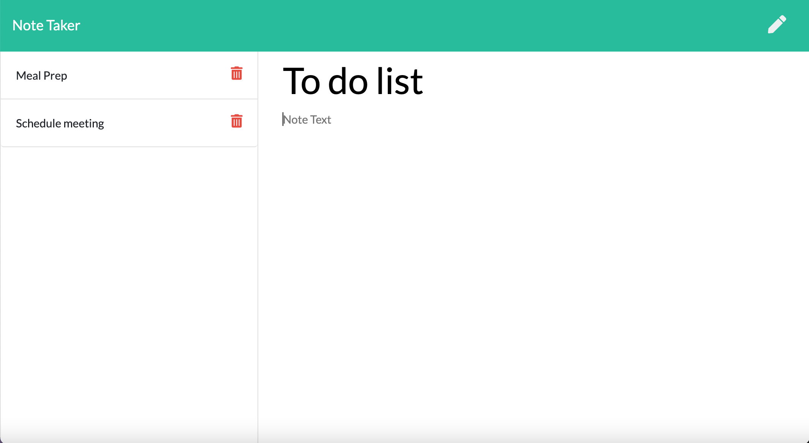

# Note Taker Application

## Description:
This is a basic note taker application that allow the user to insert notes with a title and a text. User is able to go back to old note and read them again and can delete them when they are no longer needed. 

The application uses node.js with express for setting up the ports and uniqID to create the unique ids in the api object. 

## Links:

Link to live application: https://git.heroku.com/note-taker1029.git

Link to github repository: https://github.com/rwanke14/note-taker

## Images:

## Additional sources:

Also worked with my study group to better understand how to apply what we learned in class to this readme. Note: Some code may look similar since we generally come out these thinking in the same ways. 

Feedback, brainstorming, and general support to study group:

        1. Young Ji Kim - https://github.com/youjmi
        2. Amir Ashtiany - https://github.com/Alexfit4
        3. Johnnie Simpson - https://github.com/balokdecoy
        5. Frankie Rosado - https://github.com/Franciscorosado09

